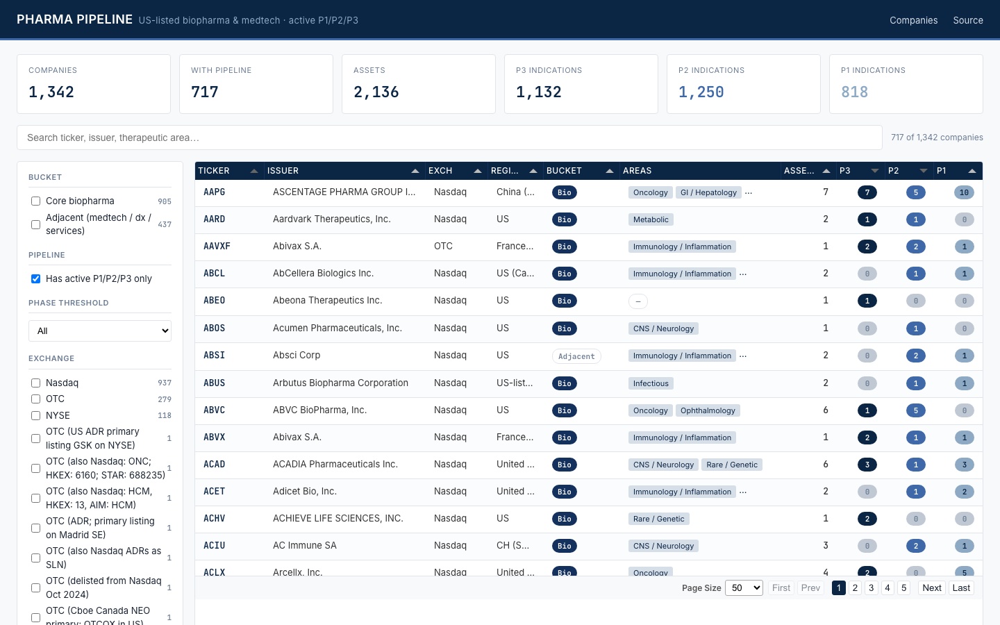

# Pharma Pipeline Web

Static, searchable browser for **1,360 US-listed biopharma & medtech companies** and their **active Phase 1 / 2 / 3 clinical pipelines**, synthesised from each company's latest 10-K, ClinicalTrials.gov, and corporate websites.

🔗 **Live demo: <https://jayxu7777.github.io/pharma-pipeline-web/>**



---

## What you can do

- Overview table of every US-listed company with an active pipeline — ticker, issuer, exchange, therapeutic focus, and counts of P1 / P2 / P3 indications.
- Full-text search across ticker, issuer name, and therapeutic area.
- Filter by **bucket** (core biopharma vs adjacent: medtech / dx / services), **phase threshold** (≥1 in P3, ≥1 in P2, …), **exchange**, and **therapeutic area**.
- Click any row to drill into the company detail page (`company.html?ticker=XXX`) showing every asset × indication × highest phase.
- Default-hides zero-pipeline rows so what you see is what's actually active.

## Data

Per-company pipelines are built by the parallel ETL project at `~/Desktop/pharma-pipeline/`, which fuses:
- The latest **10-K** from EDGAR (clinical-stage products section parsed)
- **ClinicalTrials.gov** active studies sponsored by the issuer
- **Corporate website** pipeline pages (Playwright)

Only Phase 1 / 2 / 3 assets owned by the issuer are kept. Preclinical, terminated, and partner-owned assets are excluded.

## Layout

```
index.html              Overview: company table, search, filters
company.html            Detail view (?ticker=XXX)
data/index.json         Compact overview list (~300 KB)
data/companies/*.json   Per-company full pipeline, lazy-loaded
scripts/build_web.py    Regenerates data/ from the source ETL repo
css/style.css           Styling
js/index.js, js/company.js
```

## Local preview

```bash
python3 -m http.server 8000
open http://localhost:8000/
```

## Refresh data

```bash
python3 scripts/build_web.py
```

This rebuilds `data/index.json` and `data/companies/*.json` from the source pipeline repo.

## Deploy

GitHub Pages from `main` branch, repo root.

## Disclaimer

No investment advice. Data is a synthesis of public filings and may lag the company's most recent disclosures. Always verify against the issuer's most recent 10-K, 10-Q, and 8-K filings before acting on anything you see here.
